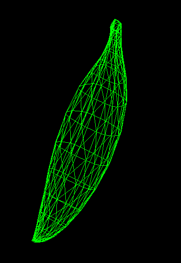
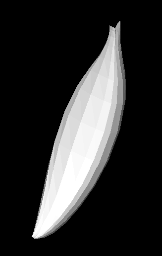
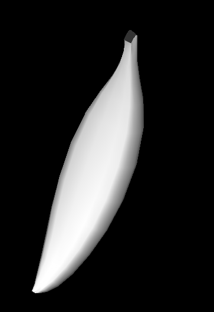
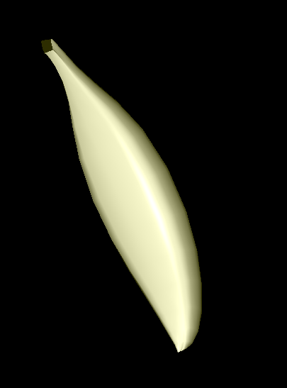
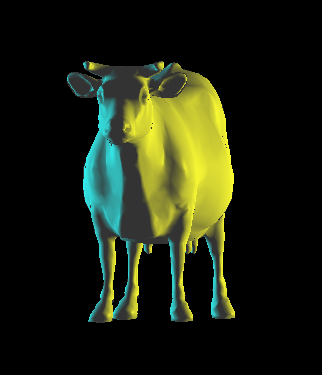

# 3D Software Renderer

A 3D renderer written in C++ that implements the full rasterization pipeline in software — transformations, triangle rasterization, depth buffering, and per-pixel lighting are all computed on the CPU. OpenGL (via freeglut) is used only to display the final pixel buffer on screen.

## Features

- **OBJ model loading** — custom parser for Wavefront `.obj` mesh files (sample models included in [`obj files/`](obj%20files/))
- **Triangle rasterization** with barycentric coordinate interpolation
- **Bresenham line drawing** for wireframe rendering
- **Z-buffer** hidden surface removal with three depth-interpolation modes (non-linear, per-pixel inverse, per-vertex inverse)
- **Shading models:**
  - Wireframe
  - Flat shading (per-face lighting)
  - Gouraud shading (per-vertex lighting, interpolated colors)
  - Phong shading (per-pixel lighting with interpolated normals)
- **Lighting** — multiple light sources, directional and point lights, plus ambient light, with per-material ambient/diffuse/specular properties
- **Camera and transformations** — model/view/projection pipeline with an interactive UI (AntTweakBar)

## Screenshots

### Shading model comparison

The same banana model rendered with each shading mode:

| Wireframe | Flat | Gouraud | Phong |
|:---:|:---:|:---:|:---:|
|  |  |  |  |

Wireframe shows the raw triangle mesh. Flat shading computes one color per face, making the individual triangles visible. Gouraud smooths the result by interpolating vertex colors across each triangle. Phong interpolates normals and lights every pixel, giving the smoothest highlights.

### Multiple light sources

Cow model lit by two directional lights (yellow and cyan) from different directions:



## Project structure

```
CG/                 Renderer source code
  Renderer.*        Rasterization, z-buffer, shading
  Scene.*           Scene management
  Camera.*          View and projection
  Light.*           Directional / point lights
  LightManager.*    Multiple light source handling
  Material.*        Ambient / diffuse / specular material properties
  Transformations.* Model transformations
  Geometry.*        Mesh and face representation
Obj Parser/         Wavefront OBJ file parser
obj files/          Sample 3D models (cow, teapot, bunny, banana, ...)
AntTweakBar/        UI library
freeglut/, Glew/    OpenGL windowing/extension libraries
glm/                Math library
```

## Building

Open `CG.sln` in Visual Studio and build for **x64**. All dependencies (freeglut, GLEW, glm, AntTweakBar) are bundled with the project.
